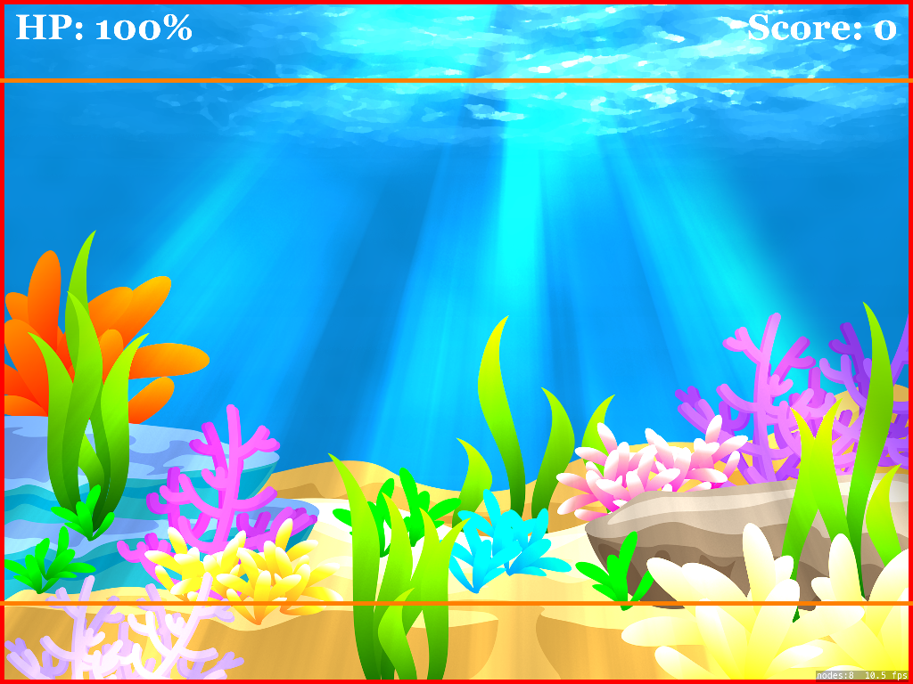

# Playable Area for a Universal Game with SpriteKit

### Preface
The playable area is a rectangle that is the same size as the user's device. The rectangle adjusts itself to fit any device from iPhones to iPads. The point of this is to position objects that are in relation to the playable are so the objects will always be in the right positions regardless of the device running the game.

Do note that I did not use SKScenes for this, but it will still work if you do. All you have to do is just gain access to the nodes you drop into the scene and position them using the playable area rectangle.

### Additional Notes
if you're going to make a universal game, then you probably must make sure that you declare the size of the game scene to be 2048x1536 in order to fit iPads. You can easily directly do this by adjusting the SKScene frame or overriding the init function of an SKScene class like I did in the example project.

### Introduction
If you're going to make a universal game, you would need to make sure that objects that are positioned in relation to the size of the device must be positioned correctly for all devices. For example, if you have a HUD that displays the game score and the player's health, then you have to make sure they appear on top of the view for all devices.

More than likely, you will be adjusting your SKScene scaleMode property as AspectFill to be able to fit an iPad. This works well, but for smaller devices, there will be a section that is cut from the top and the bottom of the device just like below. The orange rectangle represents the rendered size of an iPhone 5. Notice that there is a section on the top and bottom that is cut off.



With the following code in the next sections, you will be able to program the red rectangle, which is the playable area mentioned in the preface. As stated before, it will automatically render its size to match any device's size.

### 1. Add the Required Variables
These variables are used to calculate the size of the rectangle later. You can declare them as global variables if you want, but what is important is that the __playableArea__ variable is accessible across all scenes, so that particular variable must be global.

```
var deviceWidth = UIScreen.mainScreen().bounds.width
var deviceHeight = UIScreen.mainScreen().bounds.height
var playableArea: CGRect!
```

### 2. Decide the Game's Orientation

The next pieces of code are dependent on the Orientation of the device. Add it into the __didMoveToView__ function that is part of all SKScene classes. You could also add it before you call __super.init__ in the __init__ function.

```
//USE THIS FOR PORTRAIT
let maxAspectRatio: CGFloat = deviceHeight / deviceWidth
let playableWidth = size.height / maxAspectRatio
let playableMargin = (size.width - playableWidth) / 2.0
playableArea = CGRect(x: playableMargin, y: 0, width: playableWidth, height: size.height)


//USE THIS FOR LANDSCAPE
let maxAspectRatio: CGFloat = deviceWidth / deviceHeight
let playableHeight = size.width / maxAspectRatio
let playableMargin = (size.height - playableHeight) / 2.0
playableArea = CGRect(x:0, y: playableMargin, width: size.width, height: playableHeight)
```
### 3. Check if it Worked
That's it! All we have to do now is check that it worked, so now we just have to draw the rectangle into the view. Add this function anywhere you want inside your class to see the playable area shape and call it in __didMoveToView__ if you want.

```
func drawPlayableArea() {
    let area = SKShapeNode(rect: playableArea)
    area.lineWidth = 20
    area.strokeColor = SKColor.redColor()
    addChild(area)
}
```

 You did everything correct if there is a red rectangle filling the device's border for any device. Take a look at the following screenshots on how the red rectangle (playable area) adjusts itself to any size. Also note how the HP and score labels are still positioned in the right places.

### 4. How to Position Nodes
The last thing you need to do is just position the nodes in relation the playable area rectangle. For example, here's the code that positions the HP label to the top left. No matter the device, it will always be on the top left.

```
HPLabel.position = CGPoint(x: playableArea.minX + 35, y: playableArea.maxY - 90)
```
Note that because it's a rectangle, it's coordinate points begin at the bottom left at (0,0) whereas SpriteKit beings (0,0) at the top left. This makes it easier to know where to position the objects. The HP label is positioned to the smallest X value of 0 to the far left, and just ads 35 points to move it to the right.

### Additional Help
If you're familiar with my iOS game, [Chomp'd](https://itunes.apple.com/us/app/chompd-how-long-can-you-last/id1023110939?ls=1&mt=8), then you will know that the background is familiar and that yes, I did in fact use the same technique to make my game universal. If you need help or have some comments, you can email me at __jose.ramirez@jozemite.org__.
