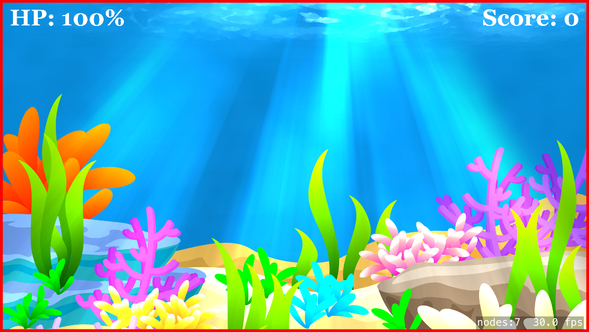
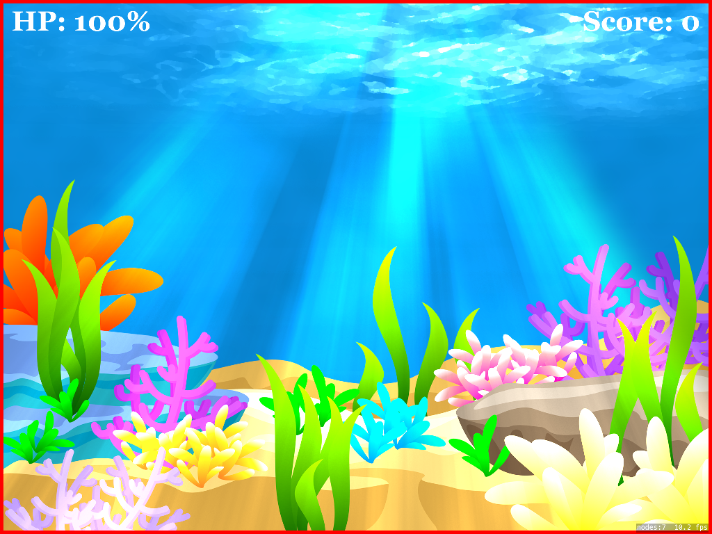

# SpriteKit: How to Position Objects for Universal Games

### Preface
When I started learning how to make games using SpriteKit, I realized that positioning
the objects based on the center of the view was not a good idea because it won't
look good on all devices. So, I realized I had to position objects related to the
border of the device, so I made my own class to handle it because using
`UIScreen.main.bounds` and `self.view!.bounds` would misplace objects, even if
I used the max X and Y values. So I created the `JKGame` class.

### Introduction
In order to use this class properly, your game's scale mode must be `aspectFill`.
The default resolution that `JKGame` uses is 1536x2048, which is the universal size
that fits well on both iPhones and iPads.

If you use `aspectFill` on smaller devices, there will be a section that is cut from the top and the bottom of the device just like in the image below. The orange rectangle represents the rendered size of an iPhone SE. Notice that there is a section on the top and bottom that is cut off. This happens because the iPhone SE cant' fully
fit what the iPad can. So if your game is universal, you must fix this issue.


It's very easy to use the `JKGame` class for a universal game. Download or copy
the class into your project.

### 1. Set the Orientation
Before the first scene is presented, you should change the orientation of `JKGame`
so that the device's border can be rendered correctly. You can do this in the
`viewDidLoad` method of the `GameViewController` class.

```
JKGame.game.setOrientation(JKOrientation.landscape)
```

### 2. Set the Scene's Size
Easily set the size of the scene with the convenience property: size. The default
value is 1536x2048.

```
let scene = GameScene(size: JKGame.size)
```

### 3. Check if it Worked
That's it! All we have to do now is check that it worked, so now we just have to draw the device's border into the view. Simply call a method from `JKGame` to view it.
Because it's using an `SKShapeNode`, it requires `self` to draw it on the `SKScene`.

The below screenshots all use the same code. Notice placement of objects are the
same no matter the screen size.

#### iPhone 5


#### iPad Air 2


```
JKGame.game.drawBorder(on: self)
```

 You did everything correct if there is a red rectangle filling the device's border for any device.

### 4. How to Position Nodes
To position nodes, you can simply use the convenience property `JKGame.rect` to get
the screen's border and use various `CGRect`'s' `maxX`, `maxY`, `minX`, etc. properties
to position objects based on the screen sides, for example:

```
// Center of the whole screen
background.position = CGPoint(x: JKGame.rect.midX, y: JKGame.rect.midY)

// Positions the object to the top right
scoreLabel.position = CGPoint(x: JKGame.rect.maxX - 35, y: JKGame.rect.maxY - 90)

// Positions the object to the top left
HPLabel.position = CGPoint(x: JKGame.rect.minX + 35, y: JKGame.rect.maxY - 90)
```

If you need to see exactly more of how it works, simply clone the repository
and check out the source files.

### Additional Help
If you're familiar with my iOS game, [Chomp'd](https://itunes.apple.com/us/app/chompd-how-long-can-you-last/id1023110939?ls=1&mt=8), then you will know that the background is familiar and that yes, I did in fact use the same technique to make my game universal. If you need help or have some comments, you can email me at __jose.ramirez@jozemite.org__.
